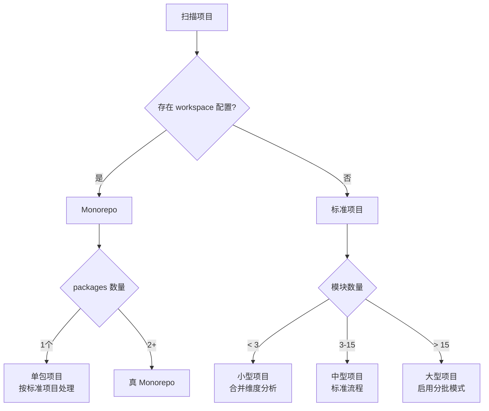
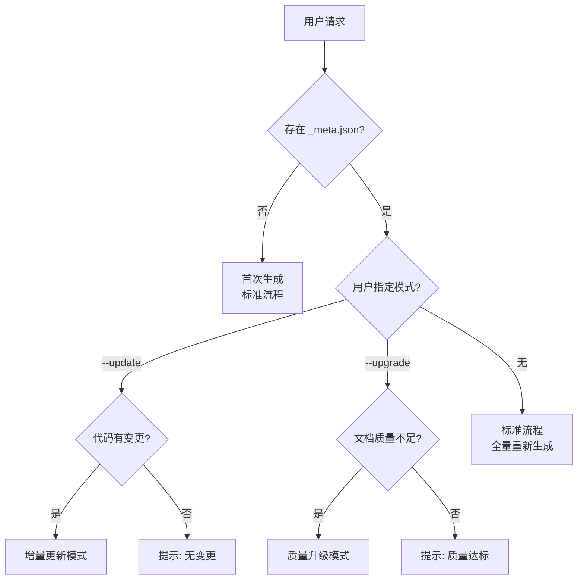
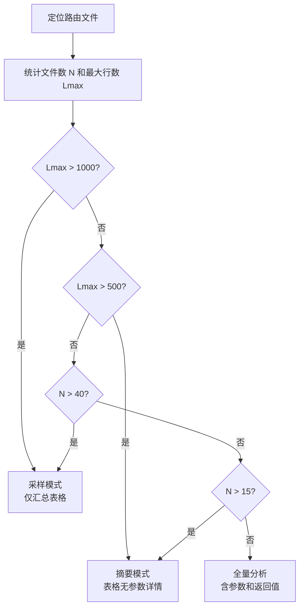

# 决策树

复杂决策逻辑的可视化指南。

## 1. 项目类型判定



**判定依据**:
- workspace 配置: `pnpm-workspace.yaml`, `package.json` workspaces, `lerna.json`
- 模块数量: `src/` 下的顶层子目录数

## 2. 运行模式选择



**模式特点**:
- 标准流程: Phase 1-5 完整执行
- 增量更新: 仅刷新变更部分，保留用户内容
- 质量升级: 重新生成低质量文档，代码不变

## 3. 子 Agent 派发决策

### 标准项目派发

```
维度子 Agent (6 个固定)
├─ architecture
├─ api-surface
├─ data-model
├─ dependencies
├─ verification
└─ infrastructure

模块子 Agent (N 个)
└─ 每个模块 1 个
```

### Monorepo 派发

```
全局维度 (4 个)
├─ architecture (包间)
├─ dependencies (包间)
├─ infrastructure
└─ verification

每个包
├─ overview (必有)
├─ api-surface (条件: bff/sdk/tool)
├─ message-protocol (条件: ui)
└─ 包内模块 (条件: 有内部模块)
```

## 4. 分析策略选择

### API Surface 分析策略



**策略说明**:
- 全量: 每个端点列出参数和返回值
- 摘要: 仅表格（方法/路径/描述）
- 采样: 按模块汇总 + 端点总数
