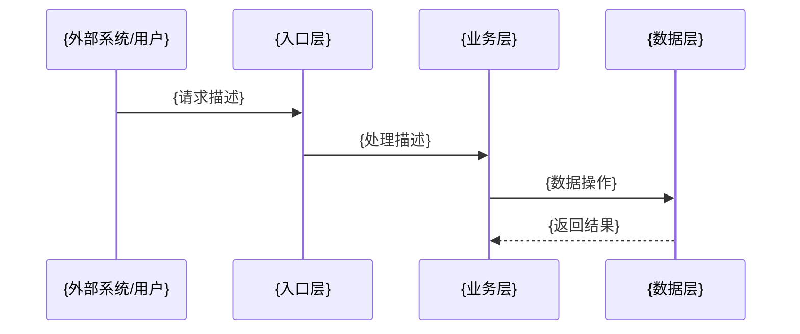

# architecture.md 模板

```markdown
# 架构设计

## 高层架构

{文本描述的架构概览，说明系统由哪些部分组成以及它们如何协作}

## 分层设计

| 层 | 职责 | 约束 |
|----|------|------|
| {层名} | {做什么} | {不能做什么} |

## 模块间调用关系

{文本描述模块间的调用方向和依赖关系}

```mermaid
flowchart TD
    {模块A} --> {模块B}
    {模块A} --> {模块C}
    {模块B} --> {模块D}
```

> 节点用模块名，箭头表示调用/依赖方向。根据实际模块关系绘制，不要照抄示例。

## 数据流

{文本描述数据在系统中的主要流向}



> 根据实际数据流绘制，参与者和消息按真实架构填写。

## 关键设计决策

| 决策 | 选择 | 理由 |
|------|------|------|
| {决策点} | {选了什么} | {为什么} |

## 跨切面关注点

### 认证与授权
{实现方式}

### 错误处理
{统一模式}

### 日志
{日志方案}

### 中间件/拦截器
{如适用}
```

## Monorepo: architecture.md 适配

当项目为 monorepo 时，全局 `architecture.md` 重点描述**包间**架构关系，而非包内模块关系。包内架构由各包的 `overview.md` 和 `modules/` 覆盖。

模板结构不变，但内容侧重调整为：
- **高层架构**: 描述各包的角色定位和协作方式
- **分层设计**: 以包为单位的分层（如 types → sdk → bff → ui）
- **调用关系图**: 包间调用方向
- **数据流**: 跨包的核心数据流（如用户请求 → sdk → proxy → 外部服务）
- **关键设计决策**: 为什么拆分为这些包、包间通信方式选择等
