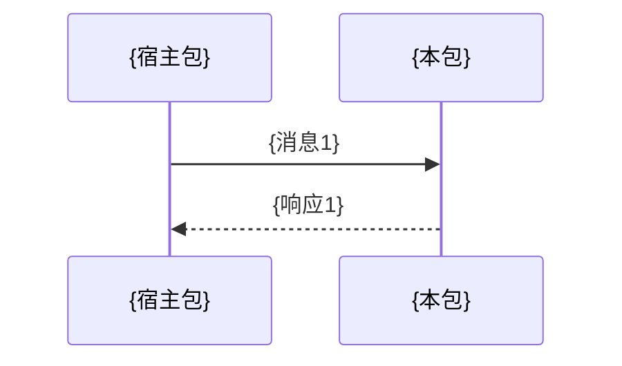

# Monorepo: packages/{name}/message-protocol.md 模板

消息协议文档。仅当包的 `recommended_dimensions` 包含 `message-protocol` 时生成（典型场景：iframe 内页面通过 postMessage 与宿主通信）。

```markdown
# {package_name} 消息协议

## 概览

通信方式: {postMessage / WebSocket / EventBus / ...}
通信对端: {与哪个包通信}
消息方向: {双向 / 单向}

## 消息格式

{通用消息结构}

```typescript
interface Message {
  type: string;
  data: any;
  // ...
}
```

## 消息类型列表

### {方向: 发出 / 接收}

| 消息类型 | 载荷结构 | 说明 | 触发时机 |
|---------|---------|------|---------|
| {type} | `{payload}` | {描述} | {什么时候发送/接收} |

## 通信时序



## 错误处理

{消息超时、失败重试等策略}
```
