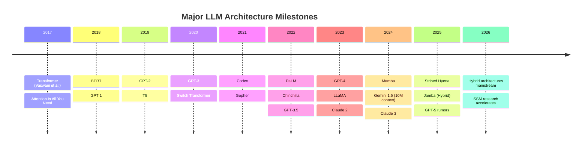
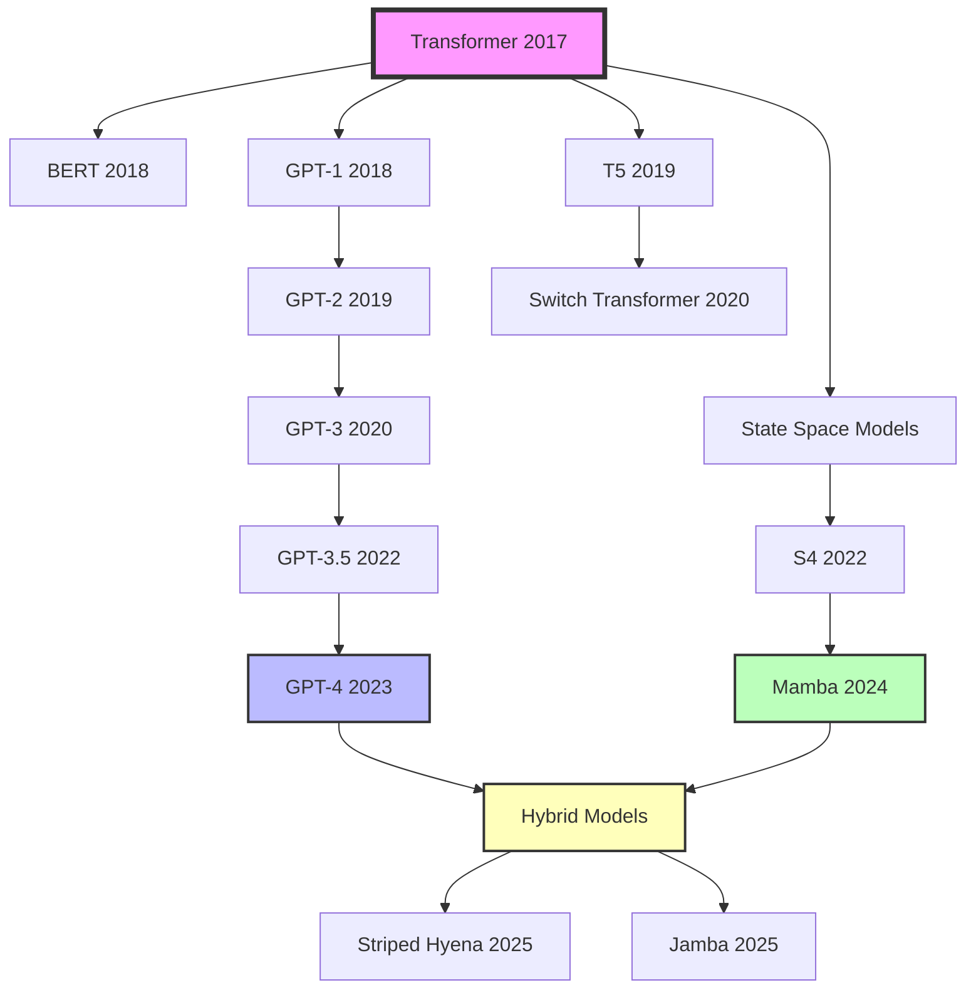

# LLM Wiki Generate

把已经沉淀在 wiki 里的知识转换成报告、摘要、演示材料或其他交付物。

## 何时使用

- 用户要报告、总结、brief、备忘录
- 用户要幻灯片、Marp 文档、对比表
- 用户要把某个主题整理成可分享文件

## 默认原则

- 生成基于 `wiki/`，不是直接基于 `raw/`
- 输出物要保留到 wiki 页面的可追溯性
- 缺信息时先指出 wiki 的空白，不要伪造补全
- 优先生成 markdown；额外格式作为可选增强

## 输出类型

常见类型：

- Markdown 报告
- 执行摘要
- 对比表
- 时间线
- Marp 幻灯片

默认放到：

```text
output/
```

## 工作流程

### 1. 明确输出目标

至少确认：

- 输出类型
- 主题范围
- 目标受众
- 详细程度

如果用户没说清楚，默认：

- 类型：Markdown 报告
- 范围：用户问题对应主题
- 受众：一般熟悉该主题的读者
- 详细程度：中等

### 2. 收集 wiki 内容

先读：

```bash
cat wiki/index.md
```

然后用 `rg` 找相关页面：

```bash
rg -n "<topic>" wiki
```

必要时直接读取相关页面。若本地有 `qmd`，可以作为增强搜索，但不是硬依赖。

### 3. 组织结构

报告常用结构：

```text
1. Executive Summary
2. Context
3. Main Findings
4. Detailed Analysis
5. Open Questions
6. Sources
```

幻灯片常用结构：

```text
1. Title
2. Why It Matters
3. Key Findings
4. Supporting Evidence
5. Recommendations / Open Questions
```

### 4. 生成文件

优先创建 markdown 文件。示例：

```markdown
---
title: <Title>
generated: YYYY-MM-DD
source_index: [[../wiki/index]]
---

# <Title>

## Executive Summary

<核心结论>

## Main Findings

### <Finding A>

<内容>

Sources:
- [[../wiki/<page-a>]]
- [[../wiki/<page-b>]]
```

### 5. 处理来源与可追溯性

输出中至少应保留：

- 关键结论对应的 wiki 页面
- 如有必要，再补充原始来源页面

优先顺序：

1. wiki 页面
2. raw 来源

### 6. 可选写回 wiki

如果生成的内容本身具有长期价值，可按用户意愿写回 wiki，例如：

- `wiki/syntheses/`
- `wiki/comparisons/`
- `wiki/briefs/`

写回时同步更新：

- `wiki/index.md`
- `wiki/log.md`

## 格式建议

### Markdown 报告

适合默认场景，最稳定。

示例：

```markdown
---
title: LLM Architecture Comparison Report
generated: 2026-04-15
source_index: [[../wiki/index]]
---

# LLM Architecture Comparison Report

## Executive Summary

This report compares three major LLM architectures: Transformer, State Space Models, and Hybrid approaches. Key finding: SSMs offer 3x inference speedup but 10% accuracy tradeoff on long-context tasks.

## Context

Based on 15 papers ingested between 2025-12 and 2026-03, covering architectural innovations in the post-GPT-4 era.

## Main Findings

### Transformer Architecture

- Dominant paradigm since 2017
- Quadratic attention complexity limits context length
- Best performance on reasoning tasks

Sources:
- [[../wiki/transformers]]
- [[../wiki/attention-mechanisms]]

### State Space Models

- Linear complexity enables 100K+ context windows
- 15-20% faster inference than Transformers
- Struggles with tasks requiring precise token-level attention

Sources:
- [[../wiki/state-space-models]]
- [[../wiki/mamba-architecture]]

### Hybrid Approaches

- Combine Transformer layers with SSM layers
- Achieves 90% of Transformer accuracy with 2x speedup
- Emerging as practical compromise

Sources:
- [[../wiki/hybrid-architectures]]
- [[../wiki/striped-hyena]]

## Open Questions

- Long-term scaling laws for SSMs unclear
- Hardware optimization for hybrid models nascent
- Training stability issues unresolved

## Sources

- [[../wiki/index]]
- [[../wiki/architectures/]]
- 15 papers in [[../raw/papers/2025-2026/]]
```

### Marp 幻灯片

适合汇报或演示。仅在用户明确要 slide deck 时生成。

示例：

```markdown
---
marp: true
theme: default
paginate: true
---

# LLM Architecture Evolution
## From Transformers to Hybrid Models

2026-04-15

---

## Why It Matters

- Context length bottleneck limits real-world applications
- Inference cost dominates deployment budgets
- New architectures promise 2-3x efficiency gains

---

## Three Paradigms

1. **Transformers** — Dominant but expensive
2. **State Space Models** — Fast but limited
3. **Hybrid** — Best of both worlds?

---

## Transformers: The Baseline

- Quadratic attention: O(n²)
- Best accuracy on reasoning tasks
- Context limited to 32K-128K tokens

**Tradeoff**: Accuracy vs. Speed

Sources: [[../wiki/transformers]]

---

## State Space Models: The Challenger

- Linear complexity: O(n)
- 100K+ context windows
- 15-20% faster inference

**Tradeoff**: Speed vs. Precision

Sources: [[../wiki/state-space-models]]

---

## Hybrid: The Compromise

- Selective attention + SSM layers
- 90% accuracy, 2x speedup
- Emerging as practical choice

**Example**: Striped Hyena, Jamba

Sources: [[../wiki/hybrid-architectures]]

---

## Open Questions

- Do SSMs scale to GPT-5 size?
- Can we train hybrids stably?
- What hardware optimizations unlock next?

---

## Recommendations

1. **Production**: Use hybrids for cost-sensitive apps
2. **Research**: Explore SSM scaling laws
3. **Infrastructure**: Invest in hybrid-optimized hardware

---

## Sources

- [[../wiki/index]]
- [[../wiki/architectures/]]
- 15 papers (2025-2026)

Full report: [[../output/llm-architecture-report.md]]
```

### 时间线 / Mermaid 图

适合时间脉络或关系梳理，但要避免为了”可视化”牺牲准确性。

示例（时间线）：

```markdown
---
title: LLM Architecture Timeline
generated: 2026-04-15
---

# LLM Architecture Timeline

## Evolution Overview



## Key Transitions

### 2017-2020: Transformer Dominance
- Attention mechanism becomes standard
- Scaling laws discovered
- Pre-training + fine-tuning paradigm

Sources: [[../wiki/transformer-era]]

### 2021-2023: Scale Race
- Models grow from 175B to 1T+ parameters
- Context windows expand to 32K-128K
- Inference cost becomes bottleneck

Sources: [[../wiki/scaling-era]]

### 2024-2026: Efficiency Era
- State Space Models challenge Transformers
- Hybrid architectures emerge
- Focus shifts from scale to efficiency

Sources: [[../wiki/efficiency-era]]

## Sources

- [[../wiki/timeline]]
- [[../wiki/architectures/]]
```

示例（关系图）：

```markdown
---
title: LLM Architecture Relationships
generated: 2026-04-15
---

# LLM Architecture Relationships

## Architecture Family Tree



## Key Relationships

- **Transformer → GPT lineage**: Decoder-only, autoregressive
- **Transformer → BERT lineage**: Encoder-only, bidirectional
- **SSM branch**: Alternative to attention mechanism
- **Hybrid convergence**: Combines Transformer + SSM strengths

Sources: [[../wiki/architecture-relationships]]
```

### 对比表

适合并列比较多个实体。

示例：

```markdown
---
title: LLM Architecture Comparison
generated: 2026-04-15
---

# LLM Architecture Comparison

## Performance Matrix

| Architecture | Context Length | Inference Speed | Accuracy (MMLU) | Training Cost | Best Use Case |
|--------------|----------------|-----------------|-----------------|---------------|---------------|
| Transformer | 32K-128K | Baseline (1x) | 85-90% | High | Reasoning, coding |
| State Space Model | 100K-1M | 3x faster | 75-85% | Medium | Long documents, retrieval |
| Hybrid | 64K-256K | 2x faster | 80-88% | High | Production balance |

Sources:
- [[../wiki/transformers]]
- [[../wiki/state-space-models]]
- [[../wiki/hybrid-architectures]]

## Detailed Comparison

### Context Length
- **Winner**: SSM (1M+ tokens)
- **Runner-up**: Hybrid (256K tokens)
- **Limitation**: Transformer (128K max)

### Inference Speed
- **Winner**: SSM (3x baseline)
- **Runner-up**: Hybrid (2x baseline)
- **Limitation**: Transformer (baseline)

### Accuracy
- **Winner**: Transformer (90% MMLU)
- **Runner-up**: Hybrid (88% MMLU)
- **Limitation**: SSM (85% MMLU)

### Cost-Effectiveness
- **Winner**: Hybrid (best accuracy/cost ratio)
- **Runner-up**: SSM (lowest inference cost)
- **Limitation**: Transformer (highest total cost)

## Recommendations by Use Case

| Use Case | Recommended Architecture | Rationale |
|----------|-------------------------|-----------|
| Research prototyping | Transformer | Best accuracy, mature tooling |
| Production chatbot | Hybrid | Balance of speed and quality |
| Document processing | SSM | Long context, fast inference |
| Code generation | Transformer | Precision matters more than speed |
| Real-time applications | SSM or Hybrid | Latency-sensitive |

Sources: [[../wiki/use-cases]]
```

## 常见错误

- 直接从 `raw/` 拼内容，绕过 wiki
- 只给漂亮结构，不给来源
- 把“尚不确定”的信息写成结论
- 生成内容太长但没有层次
- 输出物和 wiki 脱节，没有回链

## 与其他技能的边界

- 先建库：`$llm-wiki-setup`
- 先补内容：`$llm-wiki-ingest`
- 先回答和综合：`$llm-wiki-query`
- 先做健康检查或补结构：`$llm-wiki-lint`
