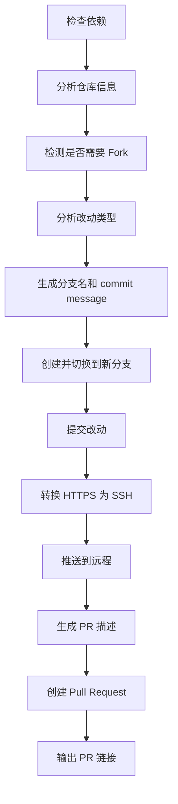

# PR Submit Skill

智能 Pull Request 提交工具，全自动分析改动、生成 PR 描述、创建并提交 Pull Request。

## 特性

✨ **智能改动分析** - 自动识别改动类型（feat/fix/docs/chore）  
📝 **自动生成描述** - 基于 git diff 生成高质量 PR 描述  
🔀 **多平台支持** - GitHub / GitLab / Gitee  
🌿 **智能分支管理** - 自动创建规范分支名  
🔒 **安全检测** - 敏感文件检测、分支保护  
🚀 **全自动执行** - 一条命令完成所有步骤

## 快速开始

### 基础用法

```bash
# 在有改动的 git 仓库中，直接运行
/pr-submit
```

### 向开源项目贡献

```bash
# 1. Clone 目标项目
git clone https://github.com/someone/awesome-project.git
cd awesome-project

# 2. 做你的修改
echo "my changes" >> README.md

# 3. 提交 PR
/pr-submit

# 自动执行：
# - Fork 仓库（如果需要）
# - 创建分支 feat/readme-updates-20260719
# - 提交改动
# - 推送到你的 fork
# - 创建 PR 到上游仓库
```

### 自己仓库的功能分支

```bash
# 1. 在你的项目中做改动
# 2. 提交 PR
/pr-submit

# 自动执行：
# - 创建 feature 分支
# - 分析改动类型
# - 提交并推送
# - 创建 PR 到 main 分支
```

## 使用场景

### 1. 向开源项目提交贡献

```bash
# 场景：给 chinese-independent-developer 添加你的项目
git clone https://github.com/1c7/chinese-independent-developer.git
cd chinese-independent-developer
# 编辑 README.md，添加你的项目
/pr-submit
```

**自动执行**：
- ✅ 检测需要 fork → 自动 fork 到你的账号
- ✅ 读取 CONTRIBUTING.md → 适配贡献指南格式
- ✅ 创建分支 `feat/add-yourname-projects`
- ✅ 生成符合项目规范的 PR 标题和描述
- ✅ 提交并推送到你的 fork
- ✅ 创建 PR 到原仓库

### 2. 新功能提交

```bash
# 场景：开发完成新功能，需要提 PR
git status  # 显示你的改动
/pr-submit
```

**自动执行**：
- ✅ 分析改动：识别为 `feat` 类型
- ✅ 创建分支 `feat/new-feature-20260719`
- ✅ 生成 commit message（包含改动统计）
- ✅ 推送并创建 PR
- ✅ PR 描述包含改动文件列表和测试清单

### 3. Bug 修复提交

```bash
# 场景：修复了一个 bug
/pr-submit
```

**自动识别**：
- 改动集中在少量文件 → `fix` 类型
- 分支名：`fix/bugname-20260719`
- commit 包含具体改动统计

### 4. 文档更新

```bash
# 场景：只修改了 markdown 文档
/pr-submit
```

**智能识别**：
- 检测到只改 `.md` 文件 → `docs` 类型
- 分支名：`docs/update-readme-20260719`

## 工作原理



## 改动类型识别

| 改动特征 | 识别为 | 分支前缀 |
|---------|-------|---------|
| 新增文件 > 60% | `feat` | `feat/` |
| 只改 `.md` 文件 | `docs` | `docs/` |
| 改动测试文件 | `test` | `test/` |
| 少量文件修改 | `fix` | `fix/` |
| 改配置/CI | `chore` | `chore/` |
| 新增行 >> 删除行 | `feat` | `feat/` |
| 其他 | `chore` | `chore/` |

## 生成的 PR 结构

```markdown
## 变更说明

[一句话概括改动目的]

## 主要改动

[git diff --stat 的前 5 行]

## 改动文件

```
[改动的文件列表]
```

## 测试

- [x] 本地测试通过
- [ ] 添加了单元测试

---
🤖 Generated with [Claude Code](https://claude.com/claude-code)
```

## 安全特性

### 自动检测和处理

1. **HTTPS → SSH 转换**（macOS）
   - 避免 osxkeychain 弹框卡死
   - 仅对 GitHub 自动转换
   - Gitee 保持 HTTPS（等配置 SSH key 后再说）

2. **敏感文件检测**
   - `.env*` 包含 secrets
   - `*.pem` / `*.key` 私钥文件
   - `credentials.json` 凭证文件
   - 检测到时会停下警告

3. **分支保护**
   - 绝不直接在 main/master 提交
   - 总是创建新分支
   - 绝不自动 force push

### 错误恢复

```bash
# PR 创建失败时，给出诊断和手动创建链接
❌ PR 创建失败，可能原因：
1. 没有权限（请确认已 fork）
2. 分支已存在 PR
3. CI 配置错误

手动创建链接：
https://github.com/<owner>/<repo>/compare/<base>...<head>
```

## 依赖要求

### 必需
- `git` - Git 版本控制
- `gh` - GitHub CLI（GitHub 仓库）

### 可选
- `glab` - GitLab CLI（GitLab 仓库）
- Gitee API token（Gitee 仓库）

### 安装

```bash
# macOS
brew install gh glab

# 登录 GitHub
gh auth login

# 登录 GitLab
glab auth login
```

## 配置（可选）

创建 `~/.config/vft-kit/pr-submit.json`：

```json
{
  "defaultBase": "main",
  "branchPrefix": {
    "feat": "feature",
    "fix": "fix",
    "docs": "docs"
  },
  "autoLink": {
    "issue": true
  },
  "language": "auto"
}
```

## 高级用法

### 指定 PR 标题

```bash
# Claude Code 中
"提 PR，标题用'feat: 添加限流部署功能'"
```

### 只提交部分文件

```bash
# 先手动 stage
git add specific-file.js

# 再提交 PR
/pr-submit
```

### Draft PR

```bash
# Claude Code 中
"提个草稿 PR"
```

自动添加 `--draft` 参数。

## 输出示例

```
━━━━━━━━━━━━━━━━━━━━━━━━━━━━━━━━━━━━━━━━
  PR Submit - 智能 Pull Request 提交工具
━━━━━━━━━━━━━━━━━━━━━━━━━━━━━━━━━━━━━━━━

ℹ 检查依赖...
✓ 依赖检查完成
ℹ 分析仓库信息...
✓ 仓库: wfly/blog, 基础分支: master
ℹ 分析改动...
✓ 改动类型: feat, 分支名: feat/workflows-updates-20260719
ℹ 生成 PR 描述...
✓ PR 描述已生成
ℹ 创建分支 feat/workflows-updates-20260719...
✓ 已提交到本地分支
✓ 已推送到远程分支
ℹ 创建 Pull Request...
✓ PR 创建成功: https://github.com/wfly/blog/pull/1

━━━━━━━━━━━━━━━━━━━━━━━━━━━━━━━━━━━━━━━━
✅ PR 已创建成功！
━━━━━━━━━━━━━━━━━━━━━━━━━━━━━━━━━━━━━━━━

🔗 PR 链接: https://github.com/wfly/blog/pull/1
📝 标题: feat: 添加限流部署工作流
🌿 分支: feat/workflows-updates-20260719 → master

下一步：
  • 等待 CI 检查通过
  • 等待维护者审核
  • 如需修改，继续在 feat/workflows-updates-20260719 分支提交即可
```

## 故障排除

### gh 命令找不到

```bash
brew install gh
gh auth login
```

### 推送失败（权限问题）

确保你有仓库的写权限，或者已经 fork 了目标仓库。

### osxkeychain 弹框

脚本会自动转换 HTTPS → SSH，如果还是弹框：

```bash
# 配置 GitHub SSH
ssh-keygen -t ed25519 -C "your_email@example.com"
# 添加到 GitHub: Settings → SSH keys
```

### PR 创建失败

查看错误信息，常见原因：
1. 分支已存在 PR → 检查是否重复
2. 没有权限 → 确认 fork 状态
3. CI 配置错误 → 查看仓库设置

## 性能优化

- ✅ 并行执行独立任务
- ✅ 贡献指南缓存 24 小时
- ✅ 3 秒分析超时机制
- ✅ 懒加载：只在需要时才 fork

## 路线图

- [ ] 支持批量 PR（monorepo）
- [ ] 自动关联 Issue
- [ ] PR 模板自动填充
- [ ] 子仓库联合提交
- [ ] 贡献指南智能解析
- [ ] CI 状态实时监控

## 许可

MIT

## 相关 Skills

- `git-auto-push` - 绕过 hooks 的快速提交
- `cc-backup-restore` - 配置备份恢复

## 反馈

遇到问题或有建议？欢迎提 Issue！
